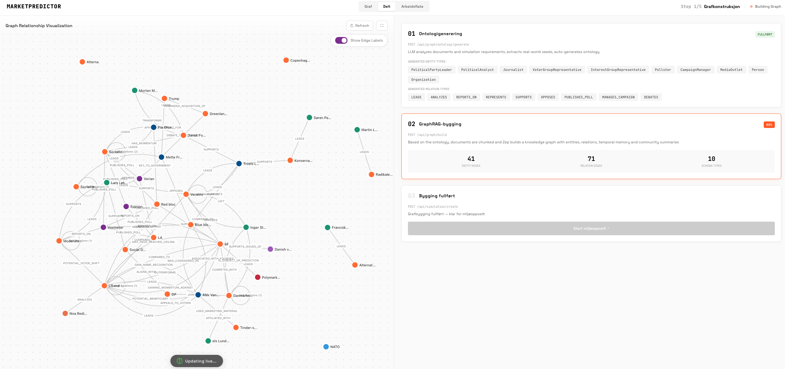
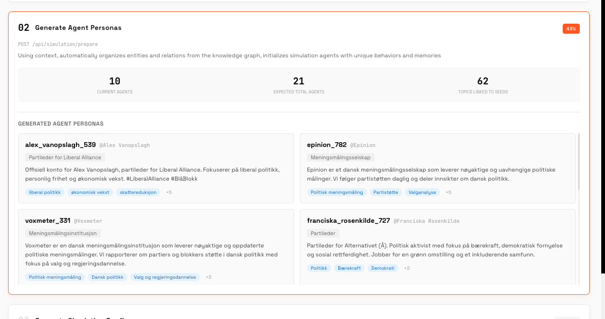
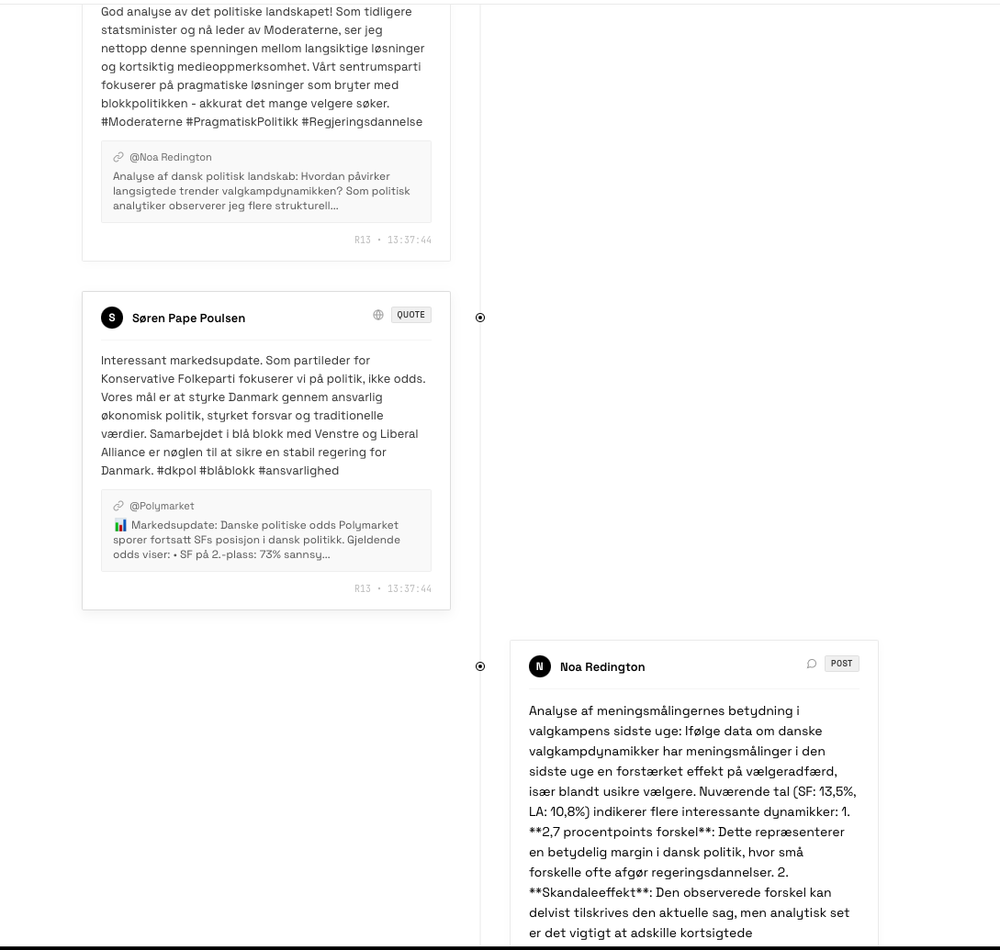

<div align="center">


**MarketPredictor** — Multi-agent AI for å predikere politiske utfall og menneskelig adferd

*En tilpasset versjon av [MiroFish](https://github.com/666ghj/MiroFish) — rettet mot prediksjonsmarkeder og hendelsesanalyse*

[](https://github.com/andreassendev/marketPredictor/stargazers)
[](https://github.com/andreassendev/marketPredictor/network)

</div>

> **⚠️ Aktivt eksperiment** — Dette prosjektet er under aktiv utvikling og testing. Jeg tweaker og tilpasser MiroFish-motoren for å utforske om multi-agent-simulering kan gi en edge i å forutsi virkelige hendelser.

## 📸 Skjermbilder

### Kunnskapsgraf

*Simulering av det danske folketingsvalget 2026 med 41 entiteter, 71 relasjoner og 10 schema-typer. Kunnskapsgrafen viser politiske partier, ledere, medier, velgergrupper og deres relasjoner.*

### AI-genererte agenter med unike personligheter

*Hver agent får en unik personlighet generert av AI — med ekte navn, yrke, interesser og adferdsmønstre. Her ser vi Alex Vanopslagh (partileder Liberal Alliance), Epinion og Voxmeter (meningsmålingsinstitusjoner), og Franciska Rosenkilde (partileder Alternativet). Agentene handler og reagerer som virkelige mennesker basert på sine personligheter.*

### Agenter som diskuterer, reagerer og danner meninger

*Agentene simulerer hvordan virkelige mennesker reagerer i forhold til hverandre. Her siterer Søren Pape Poulsen (Konservative) en Polymarket-oppdatering og kommenterer fra sitt politiske ståsted, mens Noa Redington (politisk analytiker) analyserer meningsmålingenes betydning med data — akkurat som de ville gjort i virkeligheten. Hver agent resonerer ut fra sin egen personlighet, bakgrunn og verdier.*

## ⚡ Hva er dette?

**MarketPredictor** er et eksperiment der jeg tar [MiroFish](https://github.com/666ghj/MiroFish) — en multi-agent simuleringsmotor — og tilpasser den for å predikere virkelige hendelser. Fokuset er på:

- **Hvordan mennesker reagerer på hendelser** — og hvordan reaksjoner sprer seg gjennom grupper
- **Politiske utfall** — valg, opinion shifts, skandale-effekter
- **Konsekvensanalyse** — hva skjer hvis X inntreffer? Hvordan endres dynamikken?

Kjernen er at motoren genererer **autonome AI-agenter som oppfører seg som ekte mennesker**. Hver agent får:
- En unik personlighet med MBTI-type, verdier og emosjonelle trekk
- Yrke, bakgrunn og sosiale forbindelser fra den virkelige verden
- Egne meninger, interesser og adferdsmønstre
- Hukommelse som oppdateres gjennom simuleringen

Disse agentene interagerer fritt — de poster, kommenterer, reagerer, endrer standpunkt og påvirker hverandre. Ved å observere denne dynamikken kan vi få innsikt i hvordan virkelige mennesker kan komme til å reagere på hendelser.

### Hva jeg tester akkurat nå

Jeg kjører simuleringer av **det danske folketingsvalget 2026** for å se om motoren kan:
- Predikere hvilke partier som ender på 2. og 3. plass
- Forutsi hvordan skandaler (som Liberal Alliance kokain-saken) påvirker velgeradferd
- Modellere hvordan koalisjonsforhandlinger kan utvikle seg
- Sammenligne simuleringens prediksjoner med Polymarket-odds for å finne feilprising

## 🔬 Hvordan det fungerer

1. **Seed-data** — Mata inn nyhetsartikler, meningsmålinger, aktørprofiler og kontekst
2. **Grafkonstruksjon** — Motoren bygger en kunnskapsgraf med entiteter (politikere, partier, velgergrupper, medier) og relasjoner mellom dem
3. **Agent-generering** — Hver entitet blir en autonom agent med personlighet, hukommelse og handlingslogikk
4. **Simulering** — Agentene interagerer fritt: poster, kommenterer, reagerer, endrer standpunkt
5. **Rapport** — En ReportAgent analyserer simuleringsresultatene og genererer en prediksjonsrapport

## 🎯 Bruksområder

| Kategori | Eksempel | Edge |
|----------|---------|------|
| **Politikk** | Valg, opinion shifts, skandaleeffekter | Simulerer gruppeadferd som driver utfall |
| **Prediksjonsmarkeder** | Polymarket, Kalshi, Metaculus | Finn feilprising ved å sammenligne simulering vs odds |
| **Krypto-sentiment** | Narrativskift, flokkadferd | Modellerer hvordan narrativer sprer seg |
| **Geopolitikk** | Konflikter, diplomatiske reaksjoner | Simulerer hvordan aktører responderer |

## 🚀 Hurtigstart

### Forutsetninger

| Verktøy | Versjon | Sjekk |
|---------|---------|-------|
| **Node.js** | 18+ | `node -v` |
| **Python** | ≥3.11, ≤3.12 | `python --version` |
| **uv** | Nyeste | `uv --version` |

### 1. Klon og konfigurer

```bash
git clone https://github.com/andreassendev/marketPredictor.git
cd marketPredictor
cp .env.example .env
```

Rediger `.env` med dine API-nøkler:

```env
# LLM — DeepSeek anbefales (billig + bra kvalitet)
LLM_API_KEY=din_nøkkel
LLM_BASE_URL=https://api.deepseek.com/v1
LLM_MODEL_NAME=deepseek-chat

# Zep Cloud — gratis tier holder for testing
ZEP_API_KEY=din_zep_nøkkel
```

### 2. Installer og start

```bash
npm run setup:all
npm run dev
```

Åpne `http://localhost:3000`

### 3. Kjør en prediksjon

1. Last opp en seed-fil (se `seeds/`-mappen for eksempler)
2. Skriv inn hva du vil predikere
3. La simuleringen kjøre
4. Les prediksjonsrapporten

## 📁 Seed-eksempler

- `seeds/denmark-election-2026-detailed.md` — Detaljert analyse av det danske folketingsvalget med polling-data, aktørprofiler og koalisjonsscenarier

## 🔧 Endringer fra MiroFish

- Alle systemprompts oversatt fra kinesisk til norsk/engelsk
- Agent-personas genereres på norsk
- Rapporter skrives på norsk
- Tidsconfig tilpasset europeiske/skandinaviske mønstre
- UI rebrandet til MarketPredictor
- Seed-filer for prediksjonsmarkeder

## 📄 Kreditering

- Basert på **[MiroFish](https://github.com/666ghj/MiroFish)** av MiroFish-teamet
- Simuleringsmotoren drives av **[OASIS](https://github.com/camel-ai/oasis)** fra CAMEL-AI-teamet

## 📜 Lisens

AGPL-3.0 — Se [LICENSE](./LICENSE) for detaljer.
